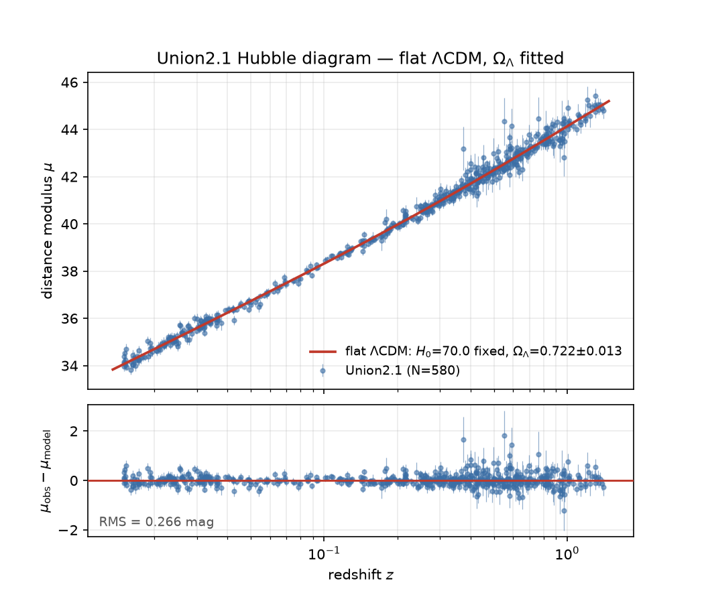

This guide works through a classic cosmology problem with your agent: using the brightness and
redshifts of supernovae to estimate the dark energy content of the universe. We fit the standard ΛCDM
model of cosmology to 580 Type Ia supernovae from
[Suzuki et al. 2012](https://arxiv.org/abs/1105.3470). Mechanically, it is a least-squares fit with a
single free parameter, Ω<sub>Λ</sub>, which runs in seconds on a laptop.

<Callout type="warn" title="Install the plugin first">
  This tutorial assumes you've installed the Lightcone plugin in your agent, as in the
  [Quick Start](/quickstart). The plugin offers to install the Lightcone CLI when you start the
  project.
</Callout>

<Callout title="Your results may vary">
  Your agent's answers will differ from the ones shown here in the details. What matters is what ends
  up in the project.
</Callout>

## 1. Start the project

Make a directory and start your agent in it:

```bash
mkdir sn-cosmology && cd sn-cosmology
claude   # or: codex
```

Then describe the analysis:

```text
I want to start a new Lightcone analysis. I'd like to fit a flat LCDM model to the Union2.1
supernova compilation to recover Omega_Lambda, varying only Omega_Lambda and using
the calibration given in the data file's header. The data is here:

  https://supernova.lbl.gov/Union/figures/SCPUnion2.1_mu_vs_z.txt

I want two outputs: the best fit, and a Hubble diagram figure with an absolute panel
and a residuals panel.
```

The agent opens with a short interview about the question and the structure of the analysis; answer
its questions. It sets up the project with `lc init`, from the [Lightcone CLI](/lightcone-cli), then
writes the analysis down in `astra.yaml` and shows you a summary. A hook validates the file each time it is saved. You should see something
like this:

```yaml title="astra.yaml (excerpt)"
inputs:
  - id: union21
    type: data
    source: data/SCPUnion2.1_mu_vs_z.txt
    description: >
      Union2.1 SN Ia compilation: 580 supernovae from z = 0.015 to 1.414. The distance
      moduli assume h = 0.7, as given in the file's header.

outputs:
  - id: best_fit
    type: metric
    format: json
    description: Best-fit Omega_Lambda with its uncertainty, chi-squared and degrees of freedom.
    inputs: [union21]
    recipe:
      command: python src/fit.py --data {inputs.union21} --out {output}

  - id: hubble_diagram
    type: figure
    format: png
    description: Distance modulus with the best-fit curve, and residuals below it.
    inputs: [union21, best_fit]
    recipe:
      command: >
        python src/plot_hubble.py --data {inputs.union21}
        --fit {inputs.best_fit} --out {output}
```

Nothing has run yet: this is the plan, and it is yours to question before any code exists.

## 2. Produce the results

```text
Download the data file into data/. Then implement the analysis: write the scripts
the recipes call, produce both outputs, and show me the Hubble diagram.
```

The agent starts a compute allocation on your machine, adds the packages it needs to the project's
environment, and writes the scripts, trying them in the same sandbox the recipes run in. It commits
its changes, then asks `lc` to produce the outputs. `lc` runs each recipe and commits each result,
with a record of how it was made. You can look for yourself:

```bash
lc status
ls results/baseline
```

Each output is a file in `results/baseline/`, named after its `id`, next to a manifest that records
the recipe, the decisions, the code version and the hashes of everything that went in. One number
comes back: **Ω<sub>Λ</sub> = 0.722 ± 0.013**.



## 3. Check it against the paper

Is this consistent with the original paper? Check it by quoting the paper, and let the tools verify
the quote:

```text
The paper that published this catalogue is Suzuki et al. 2012, arXiv 1105.3470.
Cache the paper, find their own Omega_Lambda from these supernovae, and verify the
quote. Then record it in astra.yaml as a prior insight with the quote as evidence,
and tell me how our constraint compares to theirs.
```

The agent finds the sentence in the paper and records it, with its location, as evidence:

```yaml title="astra.yaml (excerpt)"
prior_insights:
  suzuki_2012_result:
    label: "Union2.1's own dark-energy constraint"
    claim: >
      Suzuki et al. (2012) constrain the dark energy density from these supernovae alone,
      in a flat universe, to Omega_Lambda = 0.705 (+0.040, -0.043) including systematic errors.
    evidence:
      - id: suzuki_2012_sne_alone_flat_lcdm
        doi: "10.48550/arXiv.1105.3470"
        quote:
          exact: "In a flat Universe, SNe Ia alone constrain the dark-energy density, ΩΛ, to be ΩΛ = 0.705+0.040−0.043 including systematics"
        location:
          value: "page=17"
```

To run the check yourself:

```bash
uvx astra-tools@0.2.18 validate astra.yaml --verify-evidence
```

```text
✓ Schema validation passed
✓ Semantic validation passed

Verifying evidence...
✓ Evidence (prior_insights): 1/1 verified
```

The central values agree, but look at the error bars.

## 4. Add a decision

Ours are three times tighter: 0.722 ± 0.013 against their 0.705 ± 0.04, on the same 580 supernovae.
Find out why:

```text
Let's understand why our error bars are so much tighter than theirs. The Union2.1
covariance matrices are here:

  https://supernova.lbl.gov/Union/figures/SCPUnion2.1_covmat_nosys.txt
  https://supernova.lbl.gov/Union/figures/SCPUnion2.1_covmat_sys.txt

Work out which one the main data file's error column corresponds to. Then add a
decision to astra.yaml for which covariance to use, with a universe for each option,
and produce the results in both.
```

The error column matches the covariance without systematics: the fit has been statistical only. The
agent records that as a decision with two options, adds a universe for the new one, and asks `lc` for
the results. `lc` reuses the outputs that are still up to date and runs only what the new universe
needs:

```bash
lc status
```

| Result                                  | Ω<sub>Λ</sub>          |
| --------------------------------------- | ---------------------- |
| Ours, statistical only                  | 0.722 ± 0.013          |
| Ours, statistical and systematic        | **0.714 ± 0.030**      |
| Suzuki et al. 2012, published           | 0.705 (+0.040, −0.043) |

The value barely moves; the uncertainty more than doubles, and only then is it comparable with the
paper's, which includes systematics too. A comparison of best-fit values alone would have ranked this
decision as nearly irrelevant. It is the difference between a number that resembles theirs and a
number you can put beside theirs.

## 5. Write it up

```text
Write up the result in the report. Reference the outputs, the covariance decision and
the paper's value from astra.yaml instead of copying numbers, and show me a preview.
```

The report is `index.md`, written in MyST Markdown. With [MySTRA](/mystra), it cites outputs,
decisions and values by their path in `astra.yaml`, so when the analysis is re-run, the report
follows. Previewing it needs Node.js and MyST; your agent asks before installing them.

To see the report yourself, [install MyST](https://mystmd.org/guide/installing) if your agent hasn't,
then start it from the project's directory and open the address it prints:

```bash
myst start
```

## Going further

When you're done, ask your agent to release the compute allocation it started. Three more decisions
are waiting in this analysis:

- **The optimiser**: likely a null result, and worth recording as one.
- **The redshift range**: the high-redshift supernovae give the longest lever arm, and the worst
  systematics.
- **The dark energy model**: assume w = −1, or fit it, at the cost of a strong degeneracy with
  Ω<sub>Λ</sub>.

Each is one more option, one more recipe argument, and one more reason written down. To explore the
project in JupyterLab, add [Lightcone Lab](/lightcone-lab).
