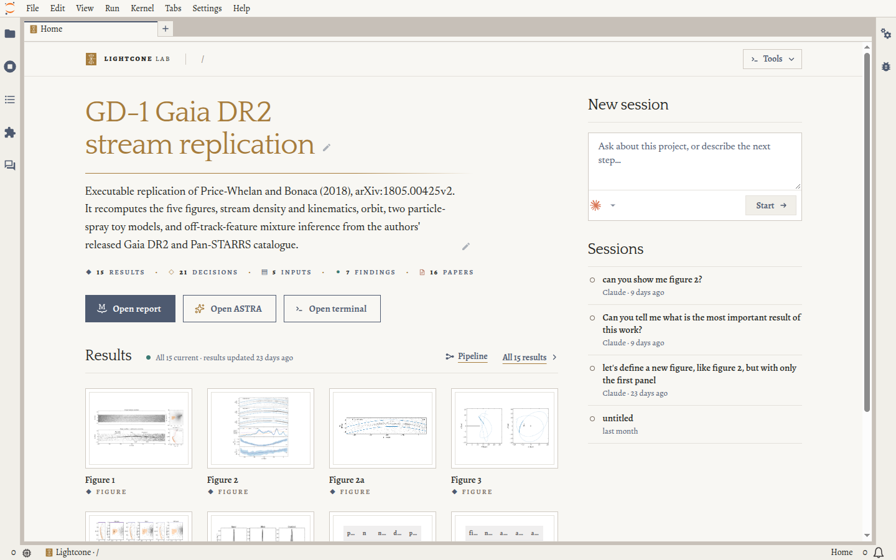

Install the Lightcone plugin in your coding agent, then give the agent a research question.

<Callout title="Before you start: install uv, if you don't have it">
  ```bash
  curl -LsSf https://astral.sh/uv/install.sh | sh
  ```
</Callout>

<Steps>
<Step>

## Install the Lightcone plugin

The plugin teaches your agent to use Lightcone. When you start a project, it checks for the
Lightcone CLI and offers to install the version it needs.

<Tabs groupId="agent" persist defaultValue="claude-code">
<TabsList>
  <TabsTrigger value="claude-code">Claude Code</TabsTrigger>
  <TabsTrigger value="codex">Codex</TabsTrigger>
  <TabsTrigger value="opencode" disabled>OpenCode (soon)</TabsTrigger>
</TabsList>
<TabsContent value="claude-code">

```bash
claude plugin marketplace add LightconeResearch/agent-skills
claude plugin install lightcone@lightcone-research
```

</TabsContent>
<TabsContent value="codex">

```bash
codex plugin marketplace add LightconeResearch/agent-skills
codex plugin add lightcone@lightcone-research
```

The first time Codex asks you to review the plugin's hooks, approve them: they are how the plugin
checks the agent's work.

</TabsContent>
</Tabs>

</Step>
<Step>

## Start your first analysis

1. **Create an empty directory** for the analysis.
2. **Start your agent** in that directory.
3. **Give it your research question** with the Lightcone skill:

<Tabs groupId="agent" persist defaultValue="claude-code">
<TabsList>
  <TabsTrigger value="claude-code">Claude Code</TabsTrigger>
  <TabsTrigger value="codex">Codex</TabsTrigger>
  <TabsTrigger value="opencode" disabled>OpenCode (soon)</TabsTrigger>
</TabsList>
<TabsContent value="claude-code">

```text
/lightcone:lightcone I want to start a new analysis: <your research question>
```

</TabsContent>
<TabsContent value="codex">

```text
$lightcone:lightcone I want to start a new analysis: <your research question>
```

</TabsContent>
</Tabs>

The agent then:

1. **Interviews you** about the research question and how to structure the analysis, before it
   writes any code.
2. **Sets up the project**: an `astra.yaml` specification, a uv environment, a git repository that keeps data and results in git-annex, and a MyST report.
3. **Writes the plan into `astra.yaml`**: the inputs, outputs, decisions and evidence. A hook
   validates the file each time the agent saves it, and the agent shows you a summary.
4. **Implements and runs the analysis** once you approve the plan. The Lightcone CLI runs each step in
   a sandbox and commits each output with a record of how it was made.

</Step>
<Step>

## Explore the project in JupyterLab (optional)

[Lightcone Lab](/lightcone-lab) shows the project in JupyterLab: its results, the decisions behind
them and the papers they cite, so you don't have to read `astra.yaml` yourself. It needs JupyterLab
4.5.10 or newer.

To install it, open JupyterLab's **Extension Manager** (the puzzle piece in the left sidebar), search
for `jupyterlab-lightcone`, install it and restart JupyterLab. Then browse into the project's
directory: the launcher becomes the project's Home.



To learn more, see [Lightcone Lab](/lightcone-lab).

</Step>
<Step>

## Keep working with your agent

Work with your agent as you would on any project. It knows Lightcone and ASTRA, and it updates the
project's record as the analysis changes. Ask it what changed since you last looked, or which results
are out of date. Keep Lightcone Lab open beside it to see each change as the agent makes it.

</Step>
</Steps>

## Next steps

- Follow [Your first analysis](/guides/first-analysis), a worked example from a research question to
  a report.
- [Run your recipes on an HPC cluster](/lightcone-cli/configuring-compute).

## Uninstall

Remove the plugin, its marketplace and the Lightcone CLI:

<Tabs groupId="agent" persist defaultValue="claude-code">
<TabsList>
  <TabsTrigger value="claude-code">Claude Code</TabsTrigger>
  <TabsTrigger value="codex">Codex</TabsTrigger>
</TabsList>
<TabsContent value="claude-code">

```bash
claude plugin uninstall lightcone@lightcone-research
claude plugin marketplace remove lightcone-research
uv tool uninstall lightcone-cli
```

</TabsContent>
<TabsContent value="codex">

```bash
codex plugin remove lightcone@lightcone-research
codex plugin marketplace remove lightcone-research
uv tool uninstall lightcone-cli
```

</TabsContent>
</Tabs>

To remove Lightcone Lab, uninstall `jupyterlab-lightcone` in JupyterLab's Extension Manager. Your
projects stay as they are, with their full record in each project's git repository.
