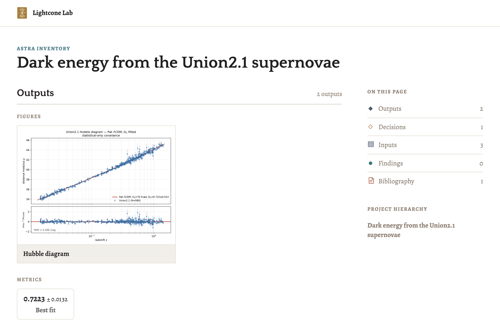
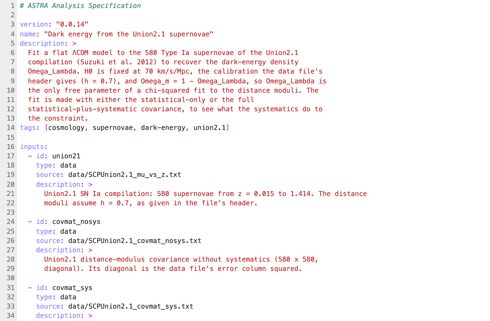

Install the Lightcone plugin in your coding agent, then give the agent a research question.

<Callout title="Before you start">
  Install [uv](https://docs.astral.sh/uv/getting-started/installation/) 0.12 or newer, if you don't
  have it already:

  ```bash
  curl -LsSf https://astral.sh/uv/install.sh | sh
  ```
</Callout>

<Steps>
<Step>

## Install the Lightcone plugin

The plugin teaches your agent to use Lightcone. When you start a project, it checks for the
Lightcone CLI and offers to install the version it needs.

<Tabs groupId="agent" persist defaultValue="claude-code">
<TabsList>
  <TabsTrigger value="claude-code">Claude Code</TabsTrigger>
  <TabsTrigger value="codex">Codex</TabsTrigger>
  <TabsTrigger value="opencode" disabled>OpenCode (soon)</TabsTrigger>
</TabsList>
<TabsContent value="claude-code">

```bash
claude plugin marketplace add LightconeResearch/agent-skills
claude plugin install lightcone@lightcone-research
```

</TabsContent>
<TabsContent value="codex">

```bash
codex plugin marketplace add LightconeResearch/agent-skills
codex plugin add lightcone@lightcone-research
```

The first time Codex asks you to review the plugin's hooks, approve them: they are how the plugin
checks the agent's work.

</TabsContent>
</Tabs>

</Step>
<Step>

## Install a UI (optional)

Lightcone records the analysis in the project's `astra.yaml`: its decisions and the alternatives you
weighed, its results, and the papers behind them. Your agent reads that file directly, but as YAML it
is hard for a person to follow. A UI shows the same record as pages you can browse, and we recommend
installing one.

<div className="grid gap-x-4 sm:grid-cols-2">
<figure>



<figcaption>A project's ASTRA inventory in Lightcone Lab.</figcaption>
</figure>
<figure>



<figcaption>The same project's `astra.yaml`.</figcaption>
</figure>
</div>

<Tabs defaultValue="jupyterlab">
<TabsList>
  <TabsTrigger value="jupyterlab">JupyterLab</TabsTrigger>
  <TabsTrigger value="vs-code" disabled>VS Code (soon)</TabsTrigger>
  <TabsTrigger value="browser" disabled>Browser (soon)</TabsTrigger>
</TabsList>
<TabsContent value="jupyterlab">

[Lightcone Lab](/lightcone-lab) is a JupyterLab extension for JupyterLab 4.5.10 or newer. Install
JupyterLab and Lab together with uv, then start JupyterLab:

```bash
uv tool install jupyterlab --with "jupyterlab-lightcone[full]" --with-executables-from jupyter-core
jupyter lab
```

To add Lab to a JupyterLab you already run, open the **Extension Manager** (the puzzle piece in the
left sidebar), search for `jupyterlab-lightcone`, install it and restart JupyterLab. That gives you
the [workbench only](/lightcone-lab/installation#choose-an-install), without agent sessions or
provenance; the [Lab installation guide](/lightcone-lab/installation) covers the full install.

</TabsContent>
</Tabs>

</Step>
<Step>

## Start your first analysis

1. **Create a project.** In Lightcone Lab, choose **New Lightcone project** in JupyterLab's launcher;
   Lab sets it up and opens its **Home**. Without Lab, create an empty directory.
2. **Start your agent** in the project's directory.
3. **Give it your research question** with the Lightcone skill:

<Tabs groupId="agent" persist defaultValue="claude-code">
<TabsList>
  <TabsTrigger value="claude-code">Claude Code</TabsTrigger>
  <TabsTrigger value="codex">Codex</TabsTrigger>
  <TabsTrigger value="opencode" disabled>OpenCode (soon)</TabsTrigger>
</TabsList>
<TabsContent value="claude-code">

```text
/lightcone:lightcone I want to start a new analysis: <your research question>
```

</TabsContent>
<TabsContent value="codex">

```text
$lightcone:lightcone I want to start a new analysis: <your research question>
```

</TabsContent>
</Tabs>

The agent then:

1. **Interviews you** about the research question and how to structure the analysis, before it
   writes any code.
2. **Sets up the project** with `lc init`, unless Lab already did: an `astra.yaml` specification, a
   uv environment, a git repository that keeps data and results in git-annex, and a MyST report.
3. **Writes the plan into `astra.yaml`**: the inputs, outputs, decisions and evidence. A hook
   validates the file each time the agent saves it, and the agent shows you a summary.
4. **Implements and runs the analysis** once you approve the plan. The Lightcone CLI runs each step in
   a sandbox and commits each output with a record of how it was made.

</Step>
<Step>

## Keep working with your agent

Work with your agent as you would on any project. It knows Lightcone and ASTRA, and it updates the
project's record as the analysis changes. Ask it what changed since you last looked, or which results
are out of date. Keep Lightcone Lab open beside it to see each change as the agent makes it.

</Step>
</Steps>

## Next steps

- Follow [Your first analysis](/guides/first-analysis), a worked example from a research question to
  a report.
- [Run your recipes on an HPC cluster](/lightcone-cli/configuring-compute).

## Uninstall

Remove the plugin, its marketplace and the Lightcone CLI:

<Tabs groupId="agent" persist defaultValue="claude-code">
<TabsList>
  <TabsTrigger value="claude-code">Claude Code</TabsTrigger>
  <TabsTrigger value="codex">Codex</TabsTrigger>
</TabsList>
<TabsContent value="claude-code">

```bash
claude plugin uninstall lightcone@lightcone-research
claude plugin marketplace remove lightcone-research
uv tool uninstall lightcone-cli
```

</TabsContent>
<TabsContent value="codex">

```bash
codex plugin remove lightcone@lightcone-research
codex plugin marketplace remove lightcone-research
uv tool uninstall lightcone-cli
```

</TabsContent>
</Tabs>

To remove Lightcone Lab, uninstall `jupyterlab-lightcone` in JupyterLab's Extension Manager, or run
`uv tool uninstall jupyterlab` if you installed it with uv. Your projects stay as they are, with their
full record in each project's git repository.
